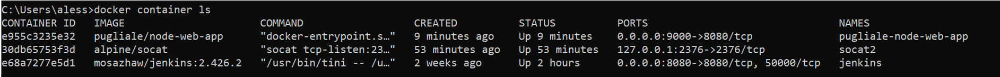

# 🚀 DevOps 08 – Docker Deployment Pipeline

## 👥 Zusammenarbeit

### 📄 Person und Repository

|                          |                                                                                              |
|--------------------------|----------------------------------------------------------------------------------------------|
| Bearbeiter               | Alessio Pugliese                                                                             |
| Repository               | [DevOps-08-Docker-Deployment](https://github.com/pugliale/DevOps-08-Docker-Deployment)      |

---

## 💻 Verwendete Systeme & Tools

| Tool / Technologie     | Beschreibung                                                                                   |
|------------------------|-----------------------------------------------------------------------------------------------|
| **Jenkins**            | CI/CD Tool zur Automatisierung von Build- und Deploymentprozessen                            |
| **Docker**             | Plattform zur Containerisierung und Verteilung von Anwendungen                                |
| **Docker Hub**         | Repository zur Veröffentlichung und Versionierung von Docker Images                           |
| **Render.com**         | Plattform zur Bereitstellung containerisierter Webanwendungen                                 |
| **GitHub**             | Source Code Management und Triggerquelle für automatisierte Builds                           |
| **Node.js / Express**  | Beispiel-Webanwendung für die CI/CD-Pipeline                                                  |

---

## 📖 Theoretischer Hintergrund

### ⚙️ Jenkins & Docker

Ziel war es, eine vollständige **DevOps-Pipeline mit Jenkins und Docker** zu implementieren. Dabei wurde in mehreren Schritten vorgegangen:

#### 1. Jenkins Job: **Docker Image Build**
- Checkout des Repositories `https://github.com/zhaw-iwi/DevOpsNodeWebApp`
- Ausführen des Node.js-Builds
- Erstellen eines Docker Images über das im Projekt enthaltene `Dockerfile`
- Anzeige und Speicherung des erzeugten Images im lokalen Docker

> Docker innerhalb von Jenkins nutzbar gemacht über:  
> `tcp://host.docker.internal:2375` (Verbindung über Plugin)

#### 2. Jenkins Job: **Docker Container Deployment**
- Optional: Alten Container stoppen und entfernen
- Start eines neuen Containers aus dem erzeugten Image
- Portweiterleitung auf `localhost:3000` zur Verifikation der Webapp
- Einsatz von **Jenkins-Variablen** wie `${DOCKER_CONTAINER_IDS}` zur Steuerung

#### 3. Verknüpfung von Jobs
- **Build-Trigger**: Nur wenn der Build erfolgreich ist, wird der Deploy-Job ausgelöst
- Trennung nach dem Prinzip „Separation of Concerns“: Build ≠ Deployment

---

### 🌐 Veröffentlichung auf Docker Hub

Nach erfolgreichem Build soll das Image auf **Docker Hub** veröffentlicht werden:

- Generieren eines **Access Tokens** über [Docker Hub Einstellungen](https://app.docker.com/settings/personal-access-tokens/create)
- Speichern als Jenkins Credential (Typ: `usernamePassword`)
- Image wird mit `docker login` und `docker push` publiziert

> Wichtig: Der Image-Name muss das Repository auf Docker Hub korrekt referenzieren  
> (z. B. `pugliale/node-web-app`)

---

### 🌍 Deployment auf Render.com

**Render.com** ist eine PaaS-Plattform zur Bereitstellung von Containern im Web.

#### Schritte:
1. Anmelden mit GitHub
2. „Web Service“ mit Quelle „Existing Docker Image“ erstellen
3. Docker Hub Image-URL angeben
4. Deployment Trigger URL generieren:  
   z. B. `https://api.render.com/deploy/<TOKEN>`
5. Token als **„Secret Text“ Credential** in Jenkins speichern
6. Deployment per `curl`-Aufruf in Pipeline integrieren:

```groovy
stage('Trigger Render Deployment') {
    steps {
        script {
            withCredentials([string(credentialsId: 'RenderDeployKey', variable: 'KEY')]) {
                sh "curl https://api.render.com/deploy/$KEY"
            }
        }
    }
}
```

---

### 🔄 Automatisierter Trigger durch Git Push

Optional wurde die Pipeline so erweitert, dass sie bei **Push-Events auf GitHub automatisch startet**. Dazu:

- GitHub Webhook oder SCM-Polling konfigurieren
- Jenkins prüft Repository auf Änderungen
- Bei Änderungen wird automatisch gebaut, getestet, deployed

---

## 🔧 Praktische Umsetzung
### 🐳 Lokale Docker-Entwicklung & Vorbereitung

---

### 📁 Projekt & Dockerfile aufbauen

Im ersten Schritt wurde das Projekt geklont und der enthaltene `Dockerfile` verwendet, um ein neues Image zu bauen:

```bash
docker build -t devops-node-webapp .
```


---

### 🚀 Container starten & testen

Der Container wurde lokal gestartet:

```bash
docker run -d -p 3000:3000 devops-node-webapp
```

Die App war anschliessend auf `http://localhost:3000` verfügbar.


---
 
### ⚙️ Jenkins Build-Job mit Dockerfile

---

### 🧩 Jenkins starten & Plugin einrichten

Jenkins wurde lokal via Docker gestartet. Danach wurde ein **neues Projekt (Freestyle-Job)** angelegt.


---

### ⚠️ Fehlerbehebung: Build-Prozessoren

Zunächst funktionierte der Build nicht korrekt, da die Prozessoranzahl auf 0 gesetzt war. Nach manueller Anpassung auf **2 Prozessoren** konnte der Build erfolgreich durchgeführt werden.


---

### 🧰 Build-Umgebung & npm install

Im nächsten Schritt wurde die Build-Umgebung eingerichtet und `npm install` im Container ausgeführt.

```bash
npm install
```


---

### 🔄 Jenkins Docker Build & Deploy Pipeline

---

### ⚙️ Docker Host in Jenkins konfigurieren

Im Jenkins-Interface wurde die Verbindung zum lokalen Docker-Daemon über `tcp://host.docker.internal:2375` eingerichtet.


---

### 🔧 Build-Job: Image erstellen

Ein **Build-Job** wurde so konfiguriert, dass er das Projekt aus GitHub clont und das Docker-Image baut:

```bash
docker build -t devops-node-webapp .
```


---

### 🚀 Deploy-Job: Container starten

Ein separater **Deploy-Job** wurde angelegt, der nach dem erfolgreichen Build automatisch ausgeführt wird.

- Zunächst wird ein alter Container entfernt (falls vorhanden):

```bash
docker rm -f node-app
```

- Danach ein neuer gestartet:

```bash
docker run -d -p 3000:3000 --name node-app devops-node-webapp
```


---

### 🔗 Build-Job triggert Deploy-Job

Die Verknüpfung der Jobs wurde so eingestellt, dass der **Deploy-Job nur bei erfolgreichem Build** ausgeführt wird.


---

### 📦 Docker Hub: Login & Push

Ziel war es, das Image nach erfolgreichem Build auf Docker Hub zu veröffentlichen.

#### Schritte:

```bash
docker login -u <username> -p <access_token>
docker tag devops-node-webapp <dockerhub_username>/node-web-app
docker push <dockerhub_username>/node-web-app
```

Ein Docker-Access-Token wurde in Jenkins als Credential gespeichert und über `withCredentials` verwendet.


---

### 🌍 Render.com Deployment per Webhook

#### Schritte:

1. Neues Web-Service auf Render erstellt (über Docker Image)
2. Deployment Trigger URL erhalten
3. Jenkins-Stage ergänzt:

```groovy
stage('Deploy to Render') {
    steps {
        withCredentials([string(credentialsId: 'RenderToken', variable: 'RENDER_KEY')]) {
            sh "curl https://api.render.com/deploy/$RENDER_KEY"
        }
    }
}
```


---

### 🔁 GitHub Trigger & automatisiertes Deployment

Zusätzlich wurde die Jenkins-Pipeline so erweitert, dass sie bei jedem Git Push automatisch startet:

- Webhook oder GitHub SCM-Polling
- Jenkins erkennt Änderungen und führt die Jobs aus
- Volle CI/CD-Pipeline von Push bis Deployment





---

### ✅ Finaler Build & Verifikation

- Container erfolgreich auf `localhost:3000` erreichbar
- Image auf Docker Hub veröffentlicht
- Render.com Service live geschaltet
- Logs und Pipelineergebnisse zeigen stabilen Ablauf


## 🧠 Erkenntnisse & Fazit

### 📌 Fachlich gelernt

- Ich habe eine vollständige **CI/CD-Pipeline mit Jenkins, Docker und Render.com** aufgebaut.
- Die Trennung von **Build- und Deploy-Job** erlaubt eine klare Verantwortlichkeitsstruktur und bessere Wartbarkeit.
- Die Integration von **Docker Hub** als öffentliches Repository für Images hat die Verbreitung vereinfacht.
- Über **Render.com** konnte ich ein externes Deployment ohne eigenen Server umsetzen – wichtig für PaaS-Szenarien.
- Der Einsatz von **Secrets, Tokens und Credentials** in Jenkins zeigte mir, wie man automatisierte Pipelines sicher gestaltet.

---

### 💬 Persönliche Reflexion

Diese Aufgabe hat mir klar gemacht, wie **vielschichtig ein echter Deployment-Prozess** ist. Neben dem technischen Aufbau waren es vor allem die kleinen Details – wie Portfreigaben, Container-Logs, automatische Trigger und Deployment-Strategien – die den Unterschied gemacht haben.

Besonders beeindruckt hat mich, wie einfach und robust sich moderne Tools wie **Docker und Render.com** in den Jenkins-Workflow einbinden lassen. Ich habe nicht nur das Toolset erweitert, sondern auch verstanden, wie man Prozesse automatisiert, versioniert und reproduzierbar macht.

> 🚀 *„CI/CD ist nicht nur Automatisierung – es ist die Kunst, stabile Innovation in jeden Commit zu bringen.“*

---

📅 *Frühjahrssemester 2025 – ZHAW School of Management and Law*

